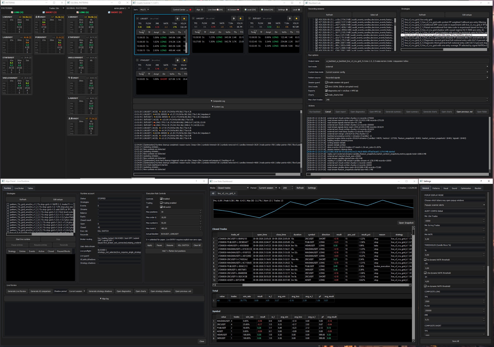

# Crypto Scanner

English | [Українська](README.uk.md)

**A personal Python project for crypto market scanning, trading strategy research, and execution analysis, developed with AI agents.**

I'm Kyrylo Symonov, and I have been developing this project since February 2026. This case study describes the system's capabilities, my decisions, and my workflow. Private strategy parameters, the full source code, and detailed trading logs are not included in this package.

## From a practical need to a tool

While finding my trading style, I mainly practiced scalping, kept detailed trading journals, and analyzed the statistics. As I gradually developed my own trading rules, I could not find the combination of signal detection features I needed in the tools I knew. This created a need for my own scanner.

The project grew from alerts for the signal combinations I needed into testing trading logic on recorded data, executing orders, comparing alternative strategies, and researching ML decisions.

I use it personally; it does not yet have external users.

**Crypto Scanner interface overview:** market scanning and signals, Backtest Lab, execution panel with risk controls, trade statistics, and settings.

## Main capabilities

| Subsystem | Purpose |
|---|---|
| Market scanner | Collect market data, calculate and visualize metrics in real time, and detect signals using defined rules |
| Recording and replay | Store events as captured by the scanner and replay them to investigate algorithm behavior |
| Backtest Lab | Compare strategy variants and analyze results at the individual trade and aggregate session levels |
| Execution and risk | Manage orders and positions with configurable limits and protective mechanisms |
| Shadow | Observe alternative strategies on separate paper accounts and compare them with actual execution during a live session |
| Trade Chart Review | Review trades across four charts, including entries, exits, detailed context, and closing reasons |
| ML research | Evaluate decisions at specific points in a trading scenario's lifecycle |

## Four ML research directions

These are four types of decisions under research that could potentially be deployed as models at the same time.

| Direction | Decision | Status of the experiment or integration described |
|---|---|---|
| **Pre-entry** | Allow or reject an entry using the context available at decision time | Multiple training configurations, temporal evaluations, and scoring integration exist; I see clear potential in this direction, and a historical candidate produced a positive offline result |
| **Scale-in** | Increase the position or retain baseline management | This experiment performs worse than the conditional deterministic model but better than the unconditional model; it is connected for shadow comparison with the baseline configuration |
| **TP-range** | Choose a take-profit distance from the alternatives under study | Offline studies cover entry-time decisions and decisions in a defined context as price approaches a target; decisions are made during the trade |
| **Entry-depth** | Retain the baseline limit entry or select a deeper level | An early model experiment investigating limit entry depth; a robust advantage has not yet been established |

See [ML lifecycle](docs/ml-lifecycle.md) for details.

## My contribution and use of AI

I define specific rules and expected product behavior, break down tasks, agree on component structure, and check the results. AI agents implement most of the code. I read familiar sections of Python code myself and continue developing my technical foundations.

AI also helped structure this documentation, which I edited for substance before publication. It reflects my actual experience and understanding of the project.

I organized seven specialized workstreams at the time of publication, in separate chats with shared and local instructions. I manage token usage according to task complexity. I use rules for targeted searches, backups, and reporting changes. I control the tool's feature scope to keep the project useful for its practical purpose.

During debugging, I initiated logging of individual pattern elements and visual trade journals. This helped move from a general observation that a result was wrong to a specific mismatch in data or logic. See the [engineering cases](docs/engineering-cases.md).

## How I evaluate results

The project uses extensive logging, event journals, replay, backtests, temporal model evaluation, shadow comparisons, and visual trade review. Feature availability at decision time and differences between simulation and actual execution are considered separately.

A positive offline result does not establish a model's readiness for live use; it highlights directions that may warrant further attention. Example reports illustrate the analysis tools and specific experiments; they do not claim consistent profitability of the system.

## Further reading

- [Architecture and data flow](docs/architecture.md)
- [Four ML research directions](docs/ml-lifecycle.md)
- [Execution, risk, and shadow](docs/execution-and-risk.md)
- [Validation, replay, and reports](docs/validation-and-replay.md)
- [Practical debugging stories](docs/engineering-cases.md)

This package provides an introduction to the project. A video walkthrough is being prepared.

## Example reports

Selected real outputs illustrate the reporting and review tools. The reports come from different runs and should not be treated as a single experiment.

- [Full Strategy Shadow Comparison](https://IronSteell.github.io/crypto-scanner-case-study/reports/shadow-comparison.html)
- [Trade Chart Review — 13 trades](https://IronSteell.github.io/crypto-scanner-case-study/reports/trade_charts.html#winners)
- [Historical pre-entry ML research](https://IronSteell.github.io/crypto-scanner-case-study/reports/pre-entry-research.html)

The report links open directly in your browser via GitHub Pages; no download is required.

### Backtest Summary example

