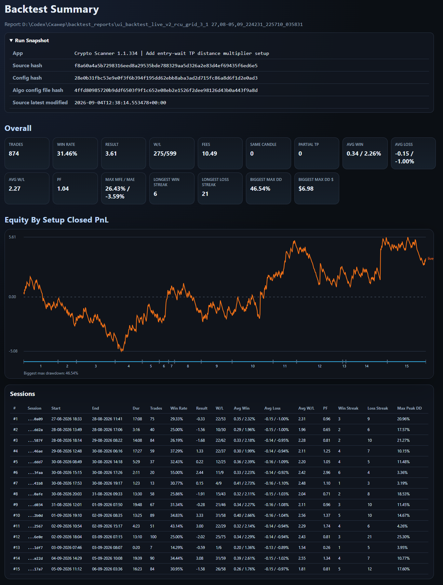

# Crypto Scanner

[English](README.md) | Українська

**Власний Python-проєкт для сканування крипторинку, дослідження торгових стратегій та аналізу їх виконання, створюваний за допомогою AI-агентів.**

Я, Кирило Симонов, розвиваю проєкт із лютого 2026 року. У цьому кейсі розповідаю про можливості системи, свої рішення та процес роботи. Приватні параметри стратегій, повний код і журнали торгівлі до цього пакета не входять.

## Від практичної потреби до інструменту

Під час скальпінгу я вів журнали угод і аналізував статистику. Поступово сформував власні торгові правила, але не знаходив у доступних мені інструментах потрібної комбінації сигналів. Так виникла потреба у власному сканері.

Проєкт виріс від пошуку сигналів до перевірки торгової логіки на записаних даних, виконання ордерів, порівняння альтернативних стратегій і дослідження ML-рішень. Використовую його особисто; зовнішніх користувачів поки немає.

## Основні можливості

| Підсистема | Для чого потрібна |
|---|---|
| Сканер ринку | Збирати ринкові дані, розраховувати метрики та знаходити сигнали за заданими правилами |
| Запис і replay | Зберігати події та відтворювати їх для дослідження поведінки алгоритмів |
| Backtest Lab | Порівнювати варіанти стратегії та аналізувати результати за угодами і сесіями |
| Виконання й ризики | Керувати ордерами та позиціями з конфігурованими обмеженнями й захисними механізмами |
| Shadow | Спостерігати за альтернативними стратегіями на окремих paper-рахунках та порівнювати їх із фактичним виконанням |
| Trade Chart Review | Розбирати угоди на графіках, бачити входи, виходи, контекст і причини завершення |
| ML-дослідження | Оцінювати рішення у визначених точках життєвого циклу торгового сценарію |

## Чотири напрями ML

Це чотири типи рішень, а не чотири однаково готові або одночасно розгорнуті моделі.

| Напрям | Рішення | Статус описаного експерименту або інтеграції |
|---|---|---|
| **Pre-entry** | Допустити чи відхилити вхід за доступним на момент рішення контекстом | Є навчання, часові перевірки та інтеграція оцінювання; для історичного кандидата отримано позитивний offline-результат |
| **Scale-in** | Збільшити позицію чи залишити базове керування | Є інтеграція APP-рішень та окремі offline-дослідження; підключення залежить від конкретної моделі й конфігурації |
| **TP-range** | Обрати відстань тейк-профіту серед досліджуваних альтернатив | Є offline-дослідження на вході та у визначеному контексті наближення до цілі |
| **Entry-depth** | Зберегти базовий лімітний вхід або обрати глибший рівень | Ранній модельний експеримент; стійку перевагу поки не доведено, до live не перенесено |

У напрямі Entry-depth досліджую вибір глибини лімітного входу. Деталі та межі перевірок - у [ML lifecycle](docs/uk/ml-lifecycle.md).

## Мій внесок і робота з AI

Я задаю предметні правила й очікувану поведінку продукту, декомпозую задачі, узгоджую структуру компонентів та перевіряю результат. Реалізація коду переважно виконується AI-агентами. Самостійно читаю знайомі ділянки Python-коду та поглиблюю технічну базу.

Документацію також готую за допомогою AI й редагую перед публікацією. Вона відображає мій досвід і розуміння проєкту.

Організував сім спеціалізованих напрямів роботи в окремих чатах зі спільними та локальними інструкціями. Використовую правила найменування, цільового пошуку, резервного копіювання та звітування про зміни. Контролюю обсяг функціональності, щоб проєкт залишався придатним для своєї практичної задачі.

Під час діагностики ініціював логування окремих елементів патернів і візуальні журнали угод. Це допомогло переходити від загального спостереження «результат неправильний» до конкретної розбіжності у даних або логіці. Приклади - у [кейcах розробки](docs/uk/engineering-cases.md).

## Як перевіряється результат

Проєкт використовує журнали подій, replay, бектести, часові перевірки моделей, shadow-порівняння та графічний розбір угод. Окремо враховуються доступність ознак на момент рішення і відмінності між симуляцією та фактичним виконанням.

Позитивний offline-результат не означає готовності моделі до live. Демонстраційні звіти характеризують інструменти аналізу та конкретні експерименти; вони не є заявою про стабільну прибутковість системи.

## Докладніше

- [Архітектура та потік даних](docs/uk/architecture.md)
- [Чотири напрями ML](docs/uk/ml-lifecycle.md)
- [Виконання, ризики та shadow](docs/uk/execution-and-risk.md)
- [Перевірки, replay та звіти](docs/uk/validation-and-replay.md)
- [Практичні історії діагностики](docs/uk/engineering-cases.md)

Цей пакет є описом проєкту, а не виконуваною демоверсією. Відеоогляд готується.

## Приклади звітів

Вибрані реальні результати демонструють інструменти аналізу та перевірки, а не стабільну прибутковість. Звіти походять із різних запусків і не є одним експериментом.

- [Full Strategy Shadow Comparison](https://IronSteell.github.io/crypto-scanner-case-study/reports/shadow-comparison.html)
- [Trade Chart Review — 13 угод](https://IronSteell.github.io/crypto-scanner-case-study/reports/trade_charts.html#winners)
- [Історичне дослідження pre-entry ML](https://IronSteell.github.io/crypto-scanner-case-study/reports/pre-entry-research.html)

Посилання відкривають звіти безпосередньо у браузері через GitHub Pages; завантажувати файли не потрібно.

### Приклад Backtest Summary

